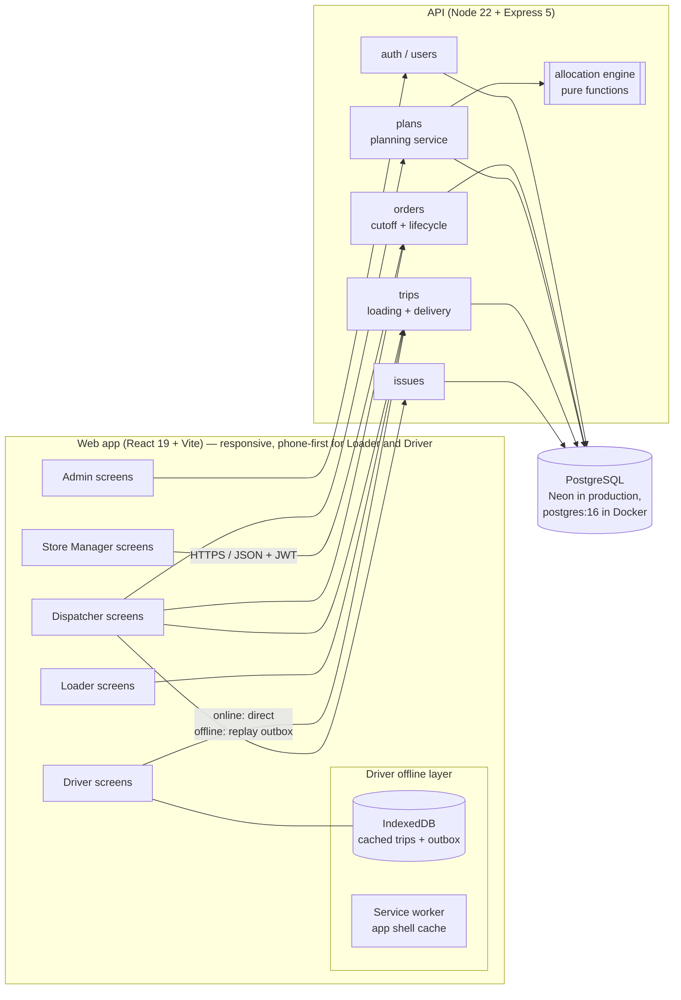
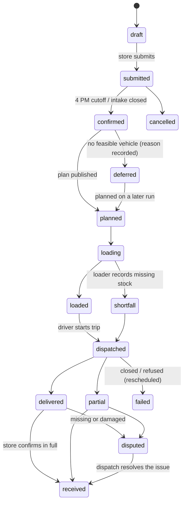
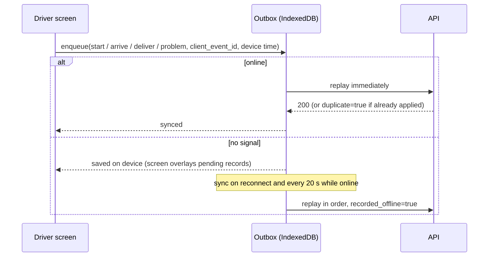

# WayFlow — Architecture

WayFlow is a monorepo with a React single-page app, a Node/Express API and a PostgreSQL database.
The four operational roles (Dispatcher, Loader, Driver, Store Manager) and the Admin use the same
web app; each role gets its own screens and API permissions.

## Components

| Part | Location | Responsibility |
| --- | --- | --- |
| Web app | `frontend/src` | Role screens (`pages/<role>`), shared components, API services (`services/*Service.js`), offline layer (`services/offline`, `public/sw.js`) |
| API | `backend/index.js`, `backend/routes` | REST endpoints under `/api/*`, JWT auth and role checks (`middleware/auth.js`) |
| Order lifecycle | `backend/services/orderStatus.js` | The single state machine every role moves orders through, with an audit event per change |
| Cutoff rules | `backend/services/orderSchedule.js` | 4 PM (Asia/Colombo) cutoff on the previous operating day, intake closing, delivery-date options |
| Planning | `backend/services/planner/planService.js` | Loads a delivery day, saves draft trips, manual moves with validation, publishing and deferral |
| Allocation engine | `backend/services/planner/engine.js` | Pure, database-free allocation and constraint validation |
| Peak-day scenario | `backend/services/planner/scenario.js` | Generates an overload day (festival demand, 10 vehicles in the workshop) |
| Schema and seed | `backend/schema.js`, `backend/seed.js`, `backend/demo.js` | Idempotent schema + migrations, dataset import, demo accounts and delivery days |

## Order lifecycle

Trips move `draft → planned → loading → loaded → dispatched → completed`.

## Planning and allocation

The engine (`engine.js`) assigns whole orders to vehicles and up to two trips per vehicle per day.
Every vehicle-day is validated against the constraints in the brief:

1. Weight and volume within the vehicle's capacity.
2. Chilled goods only on refrigerated vehicles.
3. `van_only` outlets served only by vans; vehicles serve their own depot.
4. One brand and one district per trip.
5. Trip-time budgets: Fresh trips share 270 minutes from 03:30; Style and Tech trips share 480 minutes.
   Trip time = depot-to-district travel + inter-stop travel + service allowance per stop.
6. Every stop reached before its delivery window closes (early arrivals wait for it to open).
7. The day's fuel fits the vehicle's remaining weekly fuel quota.

Orders are placed in priority order: previously deferred outlets first, then urgent orders, Fresh
chilled, Fresh ambient, Tech, then Style. Each order joins the best-fitting open trip or opens a new
trip on the vehicle that wastes the least scarce capacity, so reefers and vans stay free for orders
that need them. An order that fits nowhere stays unscheduled with the binding constraint as its
reason (for example "No refrigerated vehicle available" with the closest vehicle and the amount it
is over). Dispatchers can move orders by hand; every move is validated with the same rules before
it is saved. Publishing turns unscheduled orders into deferrals for the next operating day, which
store managers see with the reason.

## Offline operation and recovery (Driver)

- Trips are cached on the device when opened online, so a driver can reload the app without signal.
- Every driver write carries a `client_event_id`; the API stores it with a unique index, so replays
  are idempotent.
- Records keep the device time of the action and are flagged `recorded_offline`, which the
  dispatcher sees on Live Deliveries.
- A "No signal mode" switch simulates loss of connectivity for demos.

## Deployment

| Environment | Web app | API | Database |
| --- | --- | --- | --- |
| Production | Vercel (`vercel.json`) | Render (`render.yaml`) | Neon PostgreSQL |
| Local / judging | nginx container (`frontend/Dockerfile`) | Node container (`backend/Dockerfile`) | `postgres:16-alpine` container |

`docker compose up --build` starts all three containers. The API container applies the schema on
every start and seeds a fresh database once (datasets, accounts, a realistic delivery day and the
peak-day scenario).
