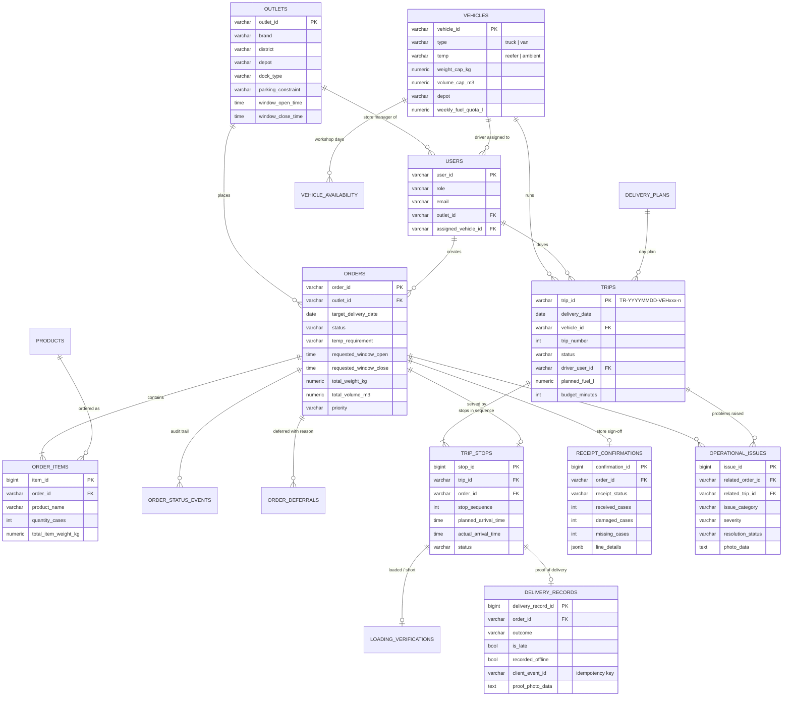

# WayFlow — Data Model

PostgreSQL schema defined in `backend/schema.js` (tables plus idempotent migrations).
Reference tables are loaded from the competition datasets; operational tables are written by the
four roles as orders move through the day.

## Entity relationships

## Tables

### Reference data (from the competition datasets)

| Table | Source | Purpose |
| --- | --- | --- |
| `outlets` | `outlets.csv` | 120 outlets: brand, district, depot, dock type, van-only / mall access, delivery window |
| `vehicles` | `vehicles.csv` | 60 vehicles: type, refrigeration, capacity, depot, fuel quota |
| `operating_calendar` | `calendar.csv` | Operating days and season (drives cutoff dates and next runs) |
| `district_travel` | `district_travel.csv` | Depot-to-district and inter-stop distance and free-flow time |
| `service_allowance` | `service_allowance.csv` | Unloading minutes per brand and dock type |
| `traffic_speed_index` | `traffic_speed.csv` | Speed index by district, hour and monsoon |
| `road_disruptions` | `road_conditions.csv` | Daily disruption index by district |
| `products` | `backend/seedProducts.js` | Orderable catalogue per brand with unit weight, volume and temperature |

### Operational data

| Table | Written by | Purpose |
| --- | --- | --- |
| `users` | Admin, seed | Accounts and roles; store managers link to an outlet, drivers to a vehicle |
| `orders`, `order_items` | Store Manager | Orders split by temperature, with window, totals and lifecycle status |
| `order_status_events` | Every role | Audit trail of each status change, with actor and note |
| `order_intake_closures` | Dispatcher | Early close of order intake for a delivery date |
| `delivery_plans` | Dispatcher | One plan per delivery date (draft or published) with unscheduled orders and reasons |
| `vehicle_availability` | Dispatcher, scenario | Vehicles in the workshop on a date |
| `trips`, `trip_stops` | Planner | Trips per vehicle and the ordered stops with planned times |
| `order_deferrals` | Planner, Dispatcher | Why an order was deferred and its next scheduled date |
| `loading_verifications` | Loader | Per-order loading check and shortfalls |
| `delivery_records` | Driver | Arrival, outcome, proof-of-delivery photo, lateness, offline flag |
| `receipt_confirmations` | Store Manager | Counted receipt per line, temperature check, discrepancies |
| `operational_issues` | Driver, Store Manager, Loader | Problems with category, severity, photo and resolution by dispatch |

## Integrity rules

- Order status changes go through `transitionOrder`, which rejects transitions the lifecycle does
  not allow and writes an `order_status_events` row in the same transaction.
- `trip_stops.order_id` is unique: an order is on at most one trip.
- `delivery_records.client_event_id` and `operational_issues.client_event_id` have unique indexes,
  so offline replays cannot create duplicates.
- `receipt_confirmations.order_id` is unique: a delivery is signed off once; later problems are
  raised as issues.
- Store managers can only read and act on their own outlet's orders; other outlets on the same trip
  are shown by position only.
